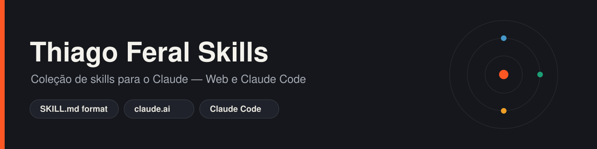
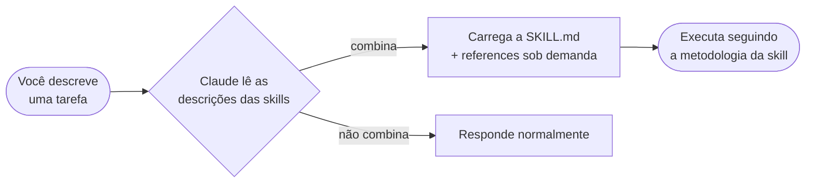

<p align="center">
  
</p>

<p align="center">
  
  
  
  
</p>

# Thiago Feral Skills

Repositório central das minhas **skills** para o Claude. Cada skill é uma capacidade reutilizável que o
Claude carrega sozinho quando faz sentido — instruções, contexto e boas práticas empacotadas numa pasta.
Funciona no **claude.ai** (Web) e no **Claude Code** (pasta local).

> **O que é uma skill?** Uma pasta com um `SKILL.md` (instruções + um cabeçalho com `name` e
> `description`) e, opcionalmente, uma pasta `references/`. O Claude lê a descrição e decide quando usar.

---

## Como uma skill funciona



A `description` no topo do `SKILL.md` é o gatilho. Skills bem descritas disparam em pedidos substantivos
sem você precisar "chamá-las" — embora você sempre possa pedir explicitamente.

---

## Catálogo de skills

| Skill | O que faz | Superfícies | Requisitos |
|---|---|---|---|
| [**supabase-owasp-audit**](skills/supabase-owasp-audit/) | Auditoria de segurança de um app com Supabase, alinhada ao **OWASP Top 10:2025**, cruzando o código com o banco ao vivo. Entrega relatório no chat com wireframes + dois `.md` (auditoria e plano de correção). | Web · Claude Code | Supabase conectado + ZIP do repositório |

> Novas skills entram aqui conforme forem criadas. Veja [CONTRIBUTING.md](CONTRIBUTING.md) para o padrão.

---

## Estrutura do repositório

```text
thiago-feral-skills/
├── README.md                     ← este arquivo
├── LICENSE
├── CONTRIBUTING.md               ← como adicionar uma nova skill
├── docs/
│   └── INSTALL.md                ← guia de instalação (Web + Claude Code)
├── assets/
│   └── hub-banner.svg
└── skills/
    └── supabase-owasp-audit/
        ├── SKILL.md              ← o que o Claude carrega
        ├── README.md             ← documentação para humanos
        ├── references/           ← material de apoio, sob demanda
        └── assets/
```

---

## Instalação rápida

O guia completo, com prints conceituais e solução de problemas, está em **[docs/INSTALL.md](docs/INSTALL.md)**.
Resumo:

<details>
<summary><b>Claude Web (claude.ai)</b></summary>

1. Compacte a pasta da skill em um ZIP:
   ```bash
   cd skills && zip -r supabase-owasp-audit.zip supabase-owasp-audit
   ```
2. No claude.ai: **Customize → Skills → "+" → "+ Create skill"** e faça **upload do ZIP**.
3. Deixe a skill **ligada** no toggle. Pronto.
</details>

<details>
<summary><b>Claude Code (pasta local)</b></summary>

```bash
git clone https://github.com/<SEU-USUARIO>/thiago-feral-skills.git
mkdir -p ~/.claude/skills
cp -r thiago-feral-skills/skills/supabase-owasp-audit ~/.claude/skills/
```
Inicie uma nova sessão (`claude`) e peça a tarefa. Skill pessoal vale em todos os projetos; para
compartilhar com o time, copie para `<repo>/.claude/skills/` (vai junto no git).
</details>

> Skills **não sincronizam** entre superfícies — instale em cada lugar onde for usar.

---

## Adicionar uma nova skill

1. Crie `skills/<nome-da-skill>/SKILL.md` (com `name` e `description` no cabeçalho).
2. Adicione `references/` se precisar de material de apoio carregado sob demanda.
3. Escreva um `README.md` da skill (use o da `supabase-owasp-audit` como modelo).
4. Registre a skill na tabela do catálogo acima.

Detalhes e convenções em **[CONTRIBUTING.md](CONTRIBUTING.md)**.

---

## Licença

[MIT](LICENSE). Use, adapte e compartilhe. As skills são material de orientação — revise as saídas antes
de agir, especialmente em contextos de segurança.
