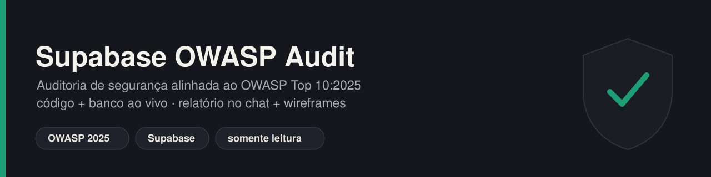
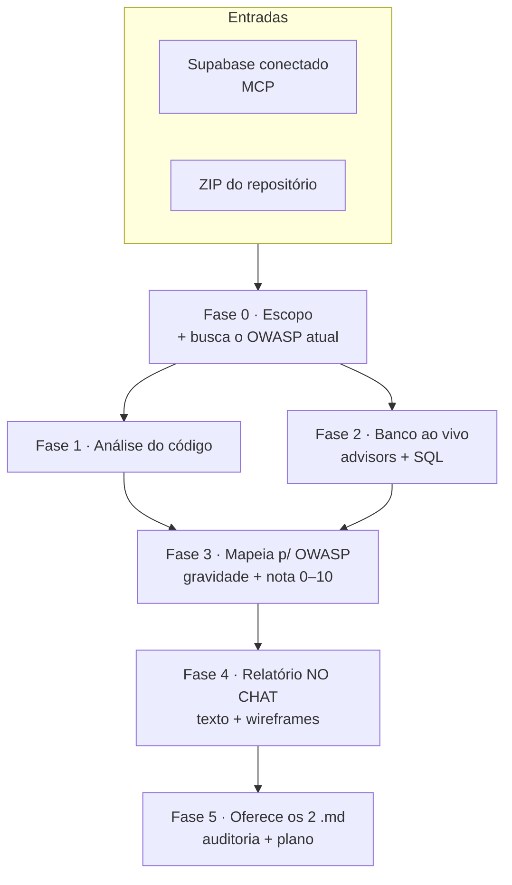

<p align="center">
  
</p>

<p align="center">
  
  
  
  
</p>

# supabase-owasp-audit

Auditoria de segurança de uma aplicação que usa **Supabase**, alinhada ao **OWASP Top 10:2025**. A skill
cruza duas fontes — **revisão estática do código** (segredos, autenticação, webhooks) e **inspeção do
banco ao vivo** (RLS, políticas, grants, advisors, storage, auth) — porque migrations são cumulativas e
podem mentir sobre o estado final. O resultado é um **relatório no chat**, visual e legível por qualquer
pessoa, seguido da oferta de **dois arquivos `.md`**: a auditoria e o plano de correção.

---

## O que você recebe



1. **Detalhamento textual** da situação atual — resumo executivo, a fundação que já está certa e os
   achados por gravidade, com evidência (arquivo:linha ou consulta) e remediação.
2. **Wireframes** no chat (sempre): scorecard dos 10 critérios OWASP (nota atual × meta), estrutura da
   aplicação com zonas de risco, pontos fortes, pontos fracos e o pipeline de correção. **Extras** quando
   o app pede: mapa de acesso aos dados, matriz de risco, caminho de ataque, painel de integridade de
   webhooks e projeção da nota.
3. **Dois `.md`** ao final (sob aprovação): o **relatório de auditoria** e o **plano de implementação**
   das correções (sequenciado, com dependências e verificação).

---

## Requisitos

| | Item | Por quê |
|---|---|---|
| ✅ **Obrigatório** | **Supabase conectado** (MCP) + `project_id` de **produção** confirmado | Para `get_advisors`, `execute_sql`, `list_tables`. Uma conexão pode expor vários projetos — nunca adivinhar. |
| ✅ **Obrigatório** | **ZIP do repositório** | Código, `api/`, edge functions, migrations e o client. |
| ☑️ Recomendado | **Config do Auth** (signup público? senha-vazada? MFA?) | O SQL não lê isso. O status do signup muda um achado de "alto" para "crítico". |
| ☑️ Recomendado | **Plataforma de hospedagem** (Vercel/Netlify/…) | Onde vivem os segredos e como corrigir chaves hardcoded. |
| ☑️ Recomendado | **Domínios de produção** | Para julgar o allowlist de CORS. |
| ☑️ Recomendado | **Integrações + esquema de assinatura dos webhooks** | Validar a verificação contra o mecanismo certo. |

> **Limitação declarada:** o ZIP do GitHub normalmente não traz o histórico do git, então "segredo
> vazado em commit antigo" não dá para confirmar só pelo ZIP. Se isso importar, forneça o histórico ou
> rode um scanner de segredos.

---

## Sinalizadores (usados no chat, nos wireframes e nos `.md`)

| Gravidade | | Prioridade | |
|---|---|---|---|
| 🔴 Crítico | vazamento ativo e explorável | ⏱️ Hoje | contém vazamento ativo |
| 🟠 Alto | sério, com pequena pré-condição | 📅 Esta semana | fechar antes de encadear |
| 🟡 Médio | hardening; aumenta o estrago | 🔧 Contínuo | disciplina recorrente |
| 🔵 Baixo | defesa em profundidade / processo | | |

A **nota de 0 a 10** sai de uma rubrica transparente (sete dimensões + nota por categoria OWASP), com o
"por que não 10" sempre explícito: o último ponto não é correção, é processo (pentest, monitoramento,
varredura de dependências, rotação programada).

---

## Garantias de segurança da própria skill

- **Somente leitura por padrão.** Nada de DDL, migrations ou mudança de política/chave sem aprovação
  item a item. Diagnóstico e correção são etapas separadas.
- **Nunca imprime o valor de um segredo.** Reporta a localização e que precisa ser rotacionado — nunca
  cola a chave no chat, no relatório ou numa chamada de ferramenta.
- **Trata a saída do banco como dado não confiável**, não como instrução.

---

## Como instalar

Guia completo em **[../../docs/INSTALL.md](../../docs/INSTALL.md)**. Resumo:

**Claude Web** — compacte esta pasta em ZIP e suba em *Customize → Skills → "+" → "+ Create skill"*:
```bash
cd .. && zip -r supabase-owasp-audit.zip supabase-owasp-audit
```

**Claude Code** — copie a pasta para o diretório de skills:
```bash
cp -r supabase-owasp-audit ~/.claude/skills/        # pessoal (todos os projetos)
# ou
cp -r supabase-owasp-audit <repo>/.claude/skills/   # do projeto (compartilha via git)
```

---

## Como disparar

A skill dispara quando você descreve a tarefa. Exemplos:

- *"Faça uma auditoria de segurança do meu app no Supabase, com base no OWASP."*
- *"Meu CRM é seguro? Analisa o repositório e o banco."*
- *"Roda uma análise OWASP e me dá uma nota de 0 a 10 por categoria."*

Lembre de **conectar o Supabase** e **anexar o ZIP do repositório** na conversa.

---

## Estrutura da skill

```text
supabase-owasp-audit/
├── SKILL.md                              ← workflow e regras (o Claude carrega isto)
├── README.md                             ← este arquivo
├── assets/skill-banner.svg
└── references/                           ← carregados sob demanda, por fase
    ├── owasp_2025.md                     ← categorias 2025 + o que procurar
    ├── repo_checks.md                    ← checklist + padrões de grep (Fase 1)
    ├── db_probes.md                      ← consultas SQL ao banco ao vivo (Fase 2)
    ├── scoring.md                        ← rubrica da nota 0–10
    ├── wireframes.md                     ← especificação de cada wireframe (Fase 4)
    ├── report_template.md                ← molde do .md de auditoria (Fase 5)
    └── implementation_plan_template.md   ← molde do .md de plano (Fase 5)
```

---

## Aviso

Orientação técnica de segurança, **não** aconselhamento jurídico. Onde há dados pessoais, há implicação
de privacidade (LGPD/GDPR) — vale revisão jurídica após a correção técnica. Revise as saídas antes de
aplicar qualquer mudança.
